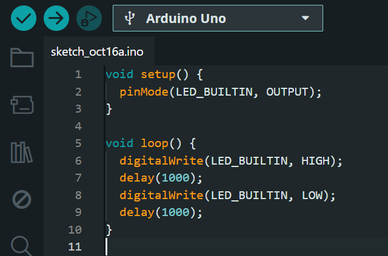

# Blink - Arduino

## 📌 Descrição
Este repositório contém o programa "Blink" do arduino, realizada como parte das atividades do módulo 4 (Solução para IoT) no **Inteli**.  
O objetivo é demonstrar o funcionamento de um circuito simples com **Arduino e LED**.

---

## 📸 Evidências do Funcionamento

### 🖥️ IDE e Código

---

### 🔌 Arduino Ligado

---

### 🎥 Vídeo
[Assista ao vídeo da demonstração](https://link-do-video.com)
